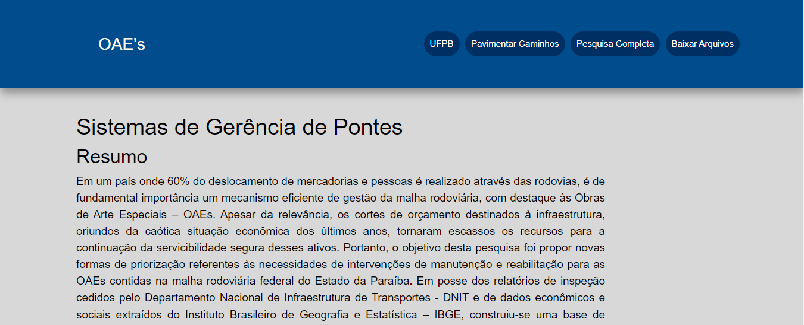

# PROJETO-REAL-003-PESQUISA-OAES

 

 
**STATUS: EM PRODUÇÃO**

    
## Detalhes
**Tecnologias** 
| HTML5, CSS3 e JavaScript | 

## Sobre o Projeto

Projeto desenvolvido para facilitação do público ao acesso da pesquisa sobre OAEs - Obras de Artes especiais do estado da Paraíba. Estudo realizada por Denner Viana, estudante de Engenharia Civil na UFPB –  João Pessoa.

## Acesse em:
https://dennerpesquisa.netlify.app/
